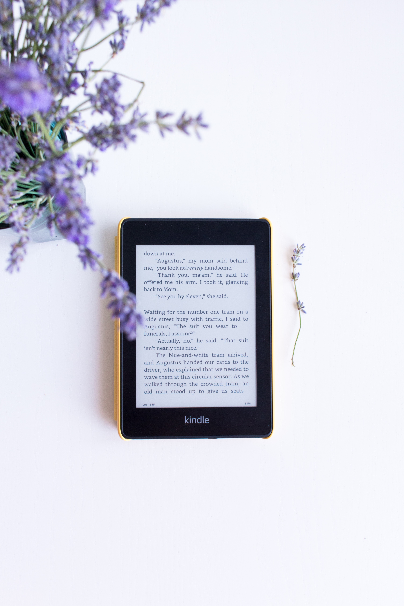

In today’s day and age, with the number of books available on Amazon; do you think it is okay to judge a book by its cover? 

With Amazon publishing around 1.5 million books in the USA alone, every year, surely judging a book, by its cover is acceptable in some way. When many writers use the platform to independently publish their books, without any real quality check or professional editing, the danger of it being just plain awful, is quite likely. But other than the blurb and possible reviews, the cover is the only other clue you have to find out if it is worth consuming. Yes, that is not always valid for all books, some writers may not have the correct funds to afford a good cover design. 

But when does the constant scrolling through pages and pages of books become tiring and repetitive. The only way to ensure you don’t lose your money through buying badly written fiction is to judge the cover, despite the controversy. If there are no reviews and very little discussion about the book online, surely this needs to be done, right?  

Well, there is one thing you can do, if you are an avid reader like me,  Kindle Unlimited is the perfect subscription. The number of books I have purchased over the years and never finished is quite embarrassing, with my money being spent on something that will stay unread on my kindle for the rest of my life, it’s quite frustrating!
Yet, when I was  introduced to Kindle Unlimited, it changed my life; I was able to try books that I had never dared try to read before, due to the cover or lack of reviews and have since become some of my favourite reads. With Kindle Unlimited, the possibility of finding even more amazing books is now endless, allowing you to swap and borrow up to 10 books each time, without risk, it is surely a heck of a lot better than just judging a book by its cover.

Lots of Love, carry on reading x
Jeni