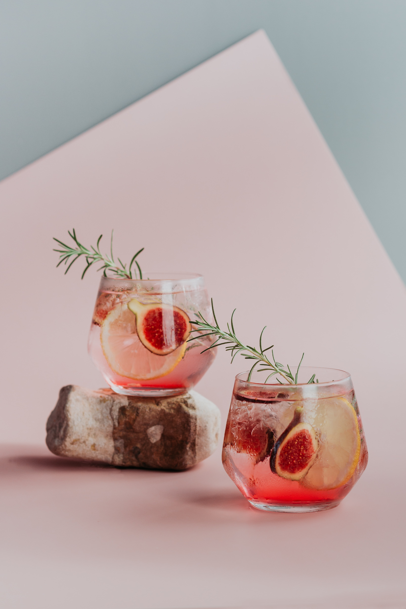

Unlock the delicious Pink Fig Delight- a perfect fusion of sweet and tangy flavours. This white rum cocktail mingles sweet rich fig with fresh zesty lemon and whispers of aromatic rosemary and fig Shrub. This cocktail is the perfect accompaniment for your summer soirée! The best time to have this cocktail is within the late summer, early autumn time, when figs are in season, giving you the fresh essence of early autumn and the reminiscent of summer nights.

## **Ingredients**

##### For the Fig Rosemary Shrub

* 2 cups diced fresh figs
* 3/4 cup granulated sugar
* 1 cup apple cider vinegar
* 10 sprigs fresh rosemary   

##### For the Cocktail

* 2 ounces white rum
* 1/2 ounce freshly squeezed lime and lemon juice 
* 2 ounces lemonade 
* Halved fresh figs for garnish
* Rosemary sprigs for garnish 
* Lemon Slices for garnish

## Method

##### *Step 1:*

To make the shrub, you need to allow it to sit in the fridge overnight, to produce the best taste, so bear this in mind before starting the recipe. The first thing you need to do is combine your figs, ( But remember to save some for garnishing!), sugar, vinegar and your rosemary sprigs in a medium bowl, mixing everything until it becomes one mixture. Cover with foil or plastic wrapping, and place at the top of your fridge overnight, ideally at 0-5 degrees.

##### *Step 2:*

In the morning, take your shrub mixture out of the fridge and take off the covering. Get a strainer or sieve, whatever you have to your disposal. Put the mixture in and use a wooden spoon to squash the juices into a bowl, making sure to get any juice left over in the fig. Then discard the figs and rosemary, leaving you with your pink fig syrup.

##### *Step 3:*

Lastly, to make the cocktail, place a handful of crushed ice into your glass, add your rum and your shrub syrup and stir using a cocktail stirrer or spoon, both work equally effective. Top the glass up with lemonade and garnish with half a slice of fresh fig, a slice of lemon and a sprig of rosemary. And here you have the pink fig delight, enjoy!

* Serves: 1
* Preparation time: 1 hour