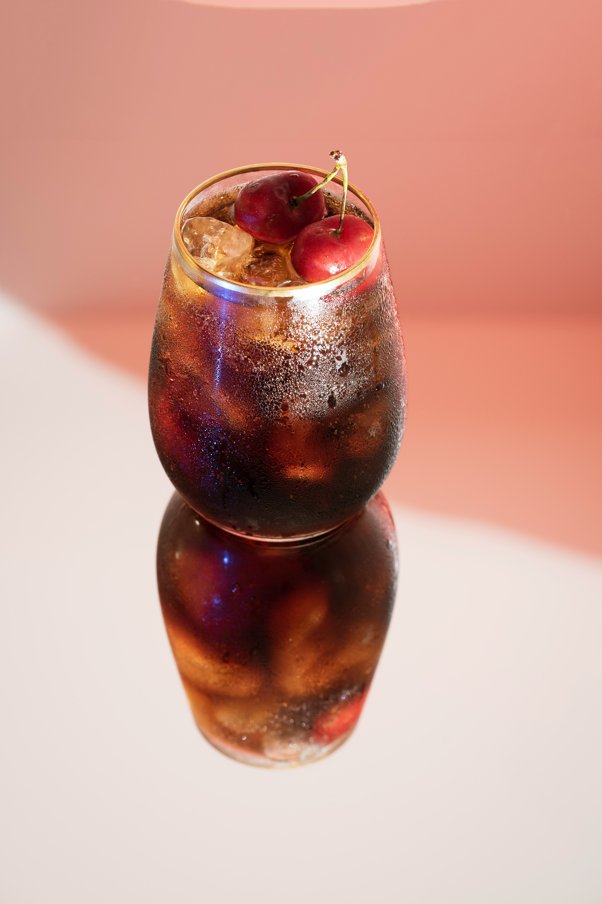

Unlock, The Rum Marie a classic yet elegant take on cherry coke, a well-loved combination across the world. The Rum Marie is a blend of dark aged rum, infused with winter spice and the sweetness of fresh cherry aroma, harmonised impeccably enhancing the iconic flavours. This is the perfect pick me up, that is ready in under 10 minutes!

**Prep Time:** 15minutes 

**Servings:** 1 cocktail, can be multiplied

## *Ingredients* 

* Cherry Simple Syrup
*  1 ½ cups Cherries
* 1 cup water
* 1 cup sugar
* 4 ounces dark spiced rum
* 12 ounces cold Coca-Cola
* ½ cup whole cherries for garnish 

##  *Method*

##### *Step 1*

To make the cherry syrup, you need to mix your cherries, chopped and sliced into a medium saucepan with your sugar and water on a medium heat, and bring it to simmer. Let the mixture heat up for about 5 minutes or so, until all the sugar has dissolved, and the mixture is starting to thicken evenly. 

##### *Step 2*

The next step is to add your cherry syrup mixture to a blender, blend it on high until it forms a puree like consistency. At this step you can strain if you desire a smooth syrup, but that is entirely up to you. After you have finished these steps, you need pour it in a bowl and cool for around 5 minutes, depending on how hot it is. 

##### *Step 3*

After the cherry syrup is cooled, fill a tall sized glass with ice and add your chopped pitted cherries, then add in 2 tablespoons of the cherry syrup and fill the glass up with iced cold Coca-Cola. Use a spoon to stir and garnish with two cherries on top for decoration. Then it’s ready to serve!