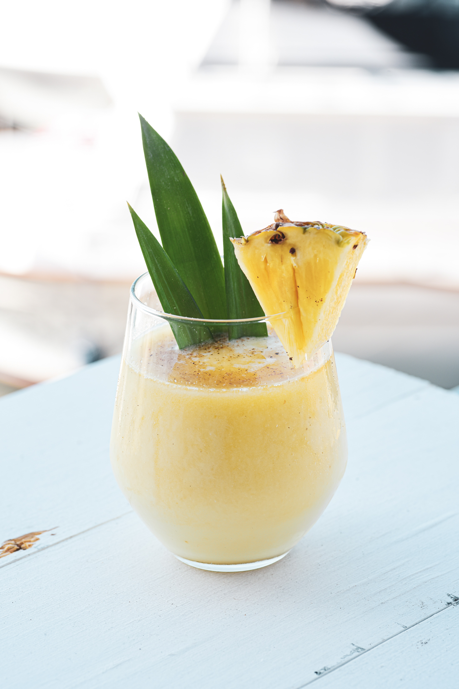

Unlock, the Pineapple Promise a sweet refreshing burst of fresh pineapple, infused with sharp rum, fresh tangy lime and a dash of coconut aroma. This is the perfect elixir for a hot summer’s day, giving you a powerful punch of pineapple, and that’s a promise!

**Prep Time:** 5 minutes 

**Servings:** 1 cocktail, can be multiplied

## *Ingredients* 

* 2 heaping cups frozen pineapple chunks 
* 6 ounces light rum 
* 2 ounces of coconut cocktail syrup
* Juice of 1 fresh lime 
* pineapple chunks and fresh lime for garnish if desired 

##  *Method*

##### *Step 1*

The first step is cut your pineapple into chunks and freeze preferably overnight, or alternatively you can buy pre frozen pineapple chunks in your local supermarkets, whatever is easier and quicker for you.

##### *Step 2*

Place your frozen pineapple in a blender with coconut cocktail syrup, rum and your lime juice. Blend until a smooth consistency.

##### *Step 3*

Pour your mixture into a medium size glass and garnish with a fresh pineapple slice and a pineapple leaf, if desired.