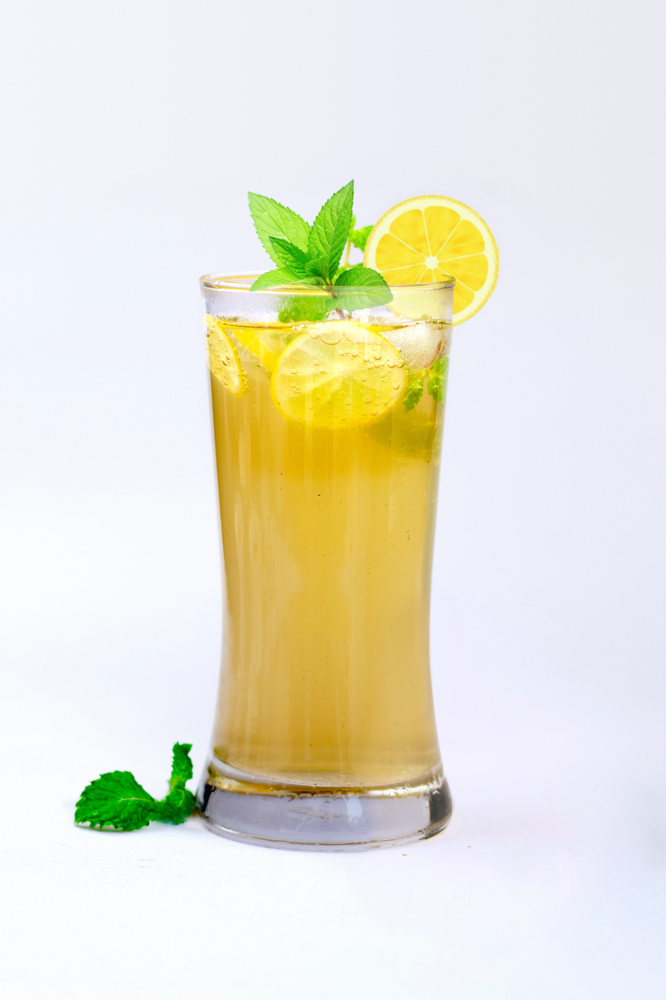

The sunshine Mojito is the perfect lemon blast, a perfect combination of zest and tang , the greatest thirst quencher. Blended together with white rum, fresh invigorating lemon and freshly crushed mint aromas, that are sure to make you the hostess with the mostest!

**Prep Time:** 10 minutes 

**Servings:** 1 cocktail, can be multiplied

## Ingredients 

* 60g (1/4 cup) white sugar
* 12 sprigs fresh mint
* 1 lemon, thinly sliced
* 300ml fresh lemon juice
* 250ml (1 cup) rum
* 1 cup crushed ice
* Soda water, chilled, to serve

##  Method

##### Step 1

The first thing you need to do Is divide your sugar and half of your mint into a medium sized, use a fork to crush and mix the mint together, until the mint is crushed and fully coated in sugar.

##### Step 2

Then you need to put the juice of half lemon and the remaining mint into your glass. Next, you need to squeeze the other half of your lemon in a bowl with your white rum, until all combined. 

##### Step 3

Next, pour your rum mixture within your glass, and top with ice and soda water. Then it’s ready to serve, a quick, easy refreshing cocktail, enjoyed both in and out the sun.