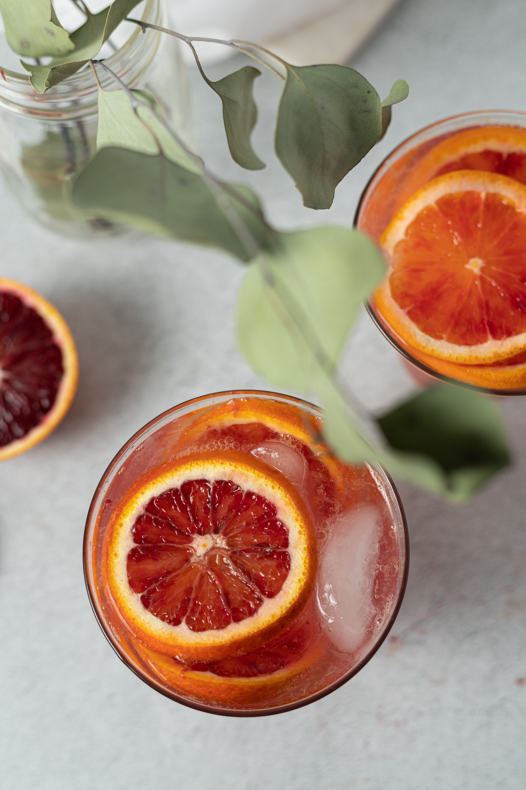

Unlock, the Lady Marmalade a fresh zesty burst of blood orange, combined with the sharpness of white rum, balanced together effortlessly, like a fine wine. The infusion of the cinnamon syrup gives warmth and spice to the tangy orange, giving the flavour new life. This is the perfect cocktail for any occasion!

**Prep Time:** 20 minutes 

**Servings:** 1 cocktail, can be multiplied

## Ingredients 

**For the cinnamon syrup:**

* 1 cup sugar
* 1 cup water
* 2 cinnamon sticks

**For the cocktail:**

* 1 1/2 ounces freshly squeezed blood orange juice
* 2 ounces white rum
* 1/2-ounce lime juice
* 1/2-ounce cinnamon simple syrup
* Blood orange slice or twist for garnish 

## Method

###### Step 1

The first step is to make the cinnamon syrup, all you need is to mix your sugar and water in a small saucepan, at medium heat until dissolved. Next add your cinnamon sticks, and reduce your heat to low and let it continue to simmer for about 10 minutes. Then let your syrup cool down and strain out your cinnamon sticks out just after.

##### Step 2 

To make the cocktail itself, you need to freshly squeeze your blood oranges and add them to them to your rum, lime and cinnamon syrup in a cocktail shaker. Next fill the shaker with ice and shake for 20 seconds, until all combined. 

###### Step 3

Lastly, strain and pour into a medium cocktail glass and garnish with fresh blood orange slices.