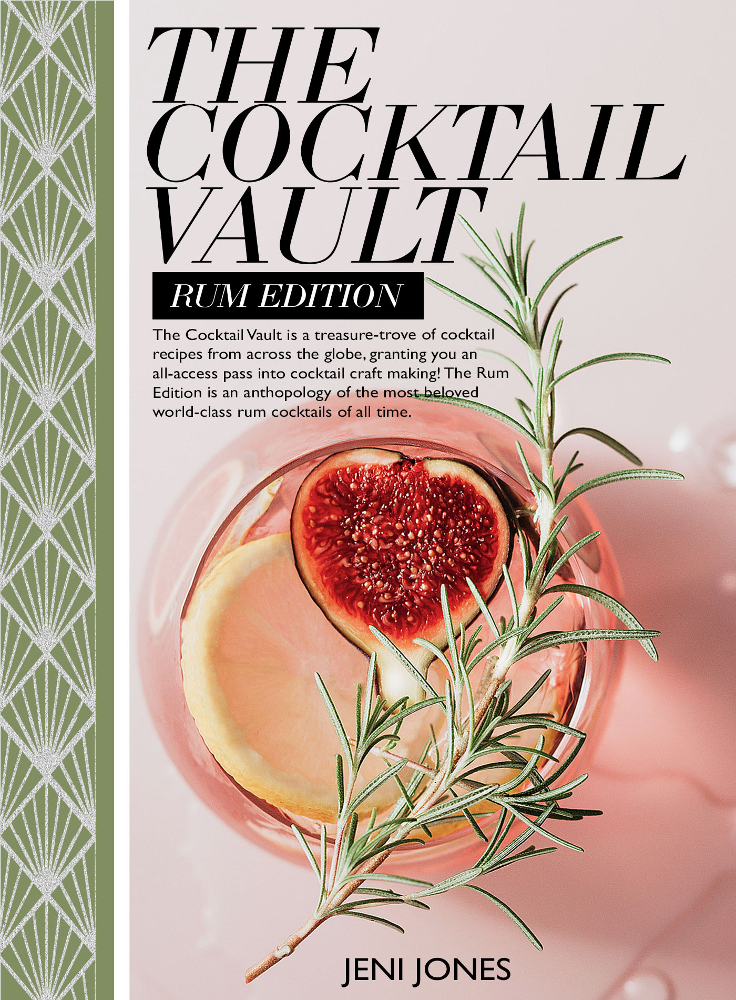

The Cocktail Vault is an anthology of the most highly distinguished Rum cocktails, from across the world, featuring recipes used in today’s day and age, in the world’s most famous bars and restaurants. The recipe guide will include a step-by-step guide of each recipe, with a description of the taste profile, allowing you to truly gain a reflection of each cocktail before you create it. The Cocktail Vault gives you an exclusive, all access pass into the world of cocktail making. The spirit Rum is the key element of all the cocktails, celebrating some of the most beloved rum cocktails, from the Pink Fig Delight to the Rum Marie, this book is an essential guide to cocktail making.

Moreover, this treasury of knowledge will truly allow you to be immersed into the creations of these secret elixirs, teaching and aiding you in becoming an excellent mixologist, definitely becoming the hostess with the mostest!

<https://itsjeni.netlify.app/allrecipes/>